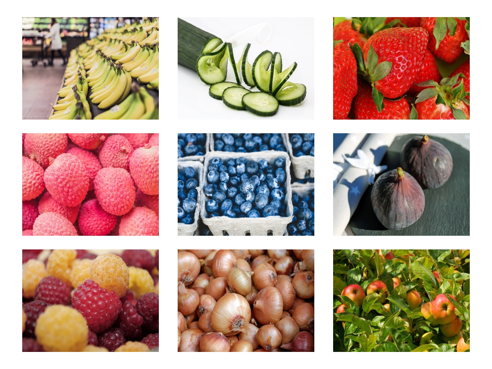

# Tech Interview Instructions

## Project: Fruit Gallery

You are given 9 images and you must create a simple image gallery. Easy, right? Well, the challenge here is that the image gallery must be responsive- meaning it resizes itself when the browser window gets smaller.

### Preview

* This is a preview of how the image gallery should look on a full size browser on a laptop:
 

   
 

* This is how the image gallery should look on a medium size browser on a tablet:
 
 
   
 

* This is how the image gallery should look on a small size browser on a phone:
  
 
    
  

  
Hint: Use flexbox.

### **Links for images:**
[Bananas](./assets/1.jpg) 
[Cucumbers](./assets/2.jpg)
 
[Strawberries](./assets/3.jpg)
 
[Raspberries](./assets/4.jpg)
 
[Blueberries](./assets/5.jpg)
 
[Persimmons](./assets/6.jpg)
 
[White Raspberries](./assets/7.jpg)
 
[Onions](./assets/8.jpg)
 
[Apples](./assets/9.jpg)
