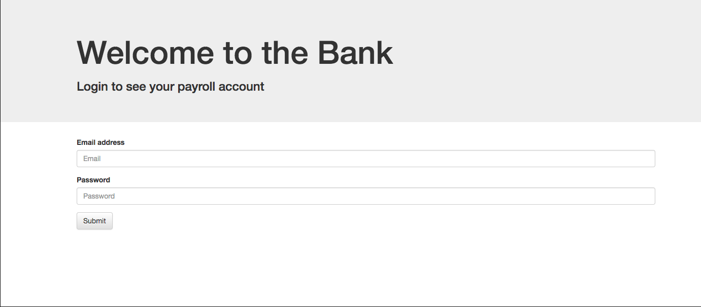
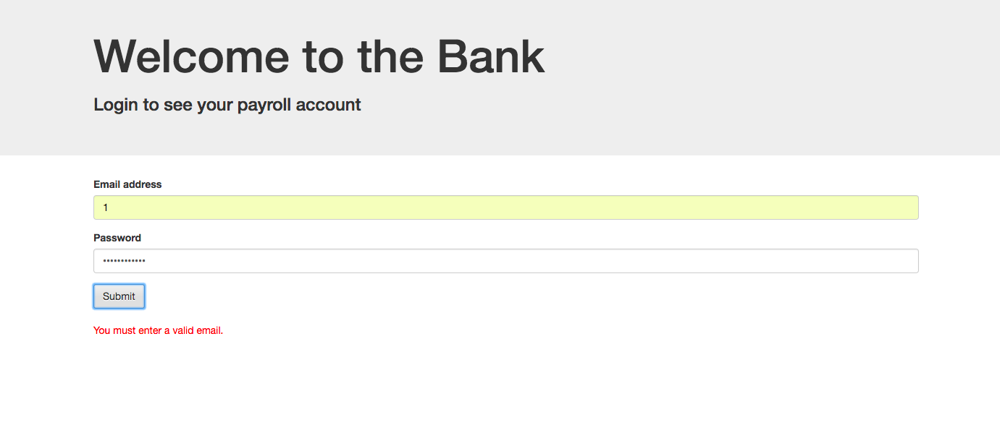
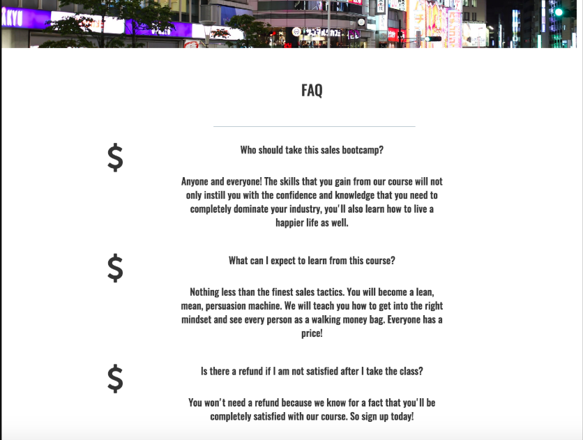

### AUSTIN COMMUNITY COLLEGE 
#### Web Software Bootcamp 

# LEARNING GOALS
In class, we will introduce jQuery, but the rest will be self-study. JQuery is a JavaScript library that will help us with Document Object Model (DOM) manipulation.

## The DOM

Understanding the DOM is fundamental for web programming.  We will revisit this in class in relation
to jQuery at an introductory level.  For a more detailed look at how a DOM is represented in memory and rendered on the browser, review
this online tutorial

[Understanding the Document Object Model](https://channel9.msdn.com/Series/Javascript-Fundamentals-Development-for-Absolute-Beginners/Understanding-the-Document-Object-Model-13)

## Slides

1. [jQuery - intro](https://docs.google.com/presentation/d/12zHIqpBVS3borjaz87kuKp40GaxiKuyyBkgZ-sVe2NI/edit?usp=sharing)
1. [jQuery - UI](https://docs.google.com/presentation/d/1f3kKpxaz96rnDz_TmqQt0t2sp08QOXJS1QExdHjp44A/edit?usp=sharing)
1. [jQuery - BucketList](https://docs.google.com/presentation/d/1hOeM5tCzrXBuR93heCpyN1MTZSY4vuB_Dr-HAO21j3k/edit?usp=sharing)

## Self Learning

[jQuery In-Depth from jQuery](https://learn.jquery.com/)

Use the above resource as a reference.  When in doubt, you should refer to this resource, or ask an instructor.

Below are two other resources. Both are very credible sources and have done a good job for students in the past. 

  [Getting Started with jQuery from Channel9 at MSDN](https://learn.microsoft.com/en-us/shows/javascript-fundamentals-development-for-absolute-beginners/getting-started-jquery-14)

or, if you prefer a text book format, you may use

  [JQuery Novice to Ninja - PDF](https://drive.google.com/file/d/1dySEW1N6QevsBrqPQaOGXy4gDjx8fcwp/view?usp=sharing)

# Bootcamp Focus

## Self Study

### <b>Why (not) jQuery?</b>
 
jQuery sounds great, right? And it is.

For many years (2006-2013) jQuery helped make front development a lot easier.

However, there are some developers in the community who now feel that jQuery is becoming unnecessary.
This is because normal, vanilla JavaScript has been evolving and is much easier to use now.

Front end code has to deal with many web page tasks repetitively, that jQuery does admirably well with minimal fuss, e.g. 

1. Selecting an element (in order to change it)
1. Making HTTP calls to get data and adding content (e.g. getting weather data from weather API, parsing it and displaying it).
1. Hiding and showing content (e.g. accordion displays)
1. Modifying a tag's attributes (e.g. changing picture by updating the src attribute of image tag) or changing it's class.
1. Adding event handler function(s) to elements one at a time, or as a collection.
1. Determining the value from forms 
1. Making the browser react to different user interactions (e.g. clicking or hovering on an element).
1. Animating changes (e.g. an animation of a change to improve usability), etc.

jQuery is also famous for:

1. Being browser agnostic (both browser family and versions).  This implies that most of the time you don't have to worry about browser differences.  They have been dealt with within the guts of jQuery.  It just works, right out of the box and through current and future changes in browsers.
1. Being mobile friendly (e.g. jQuery Mobile and jQuery UI.  jQm allows for "touch" events).
1. Being customizable (i.e. build your custom jQuery file using the functionality you need in order to further reduce size of the jquery.js file (ref: https://stackoverflow.com/questions/3143195/can-you-create-a-custom-jquery-library-build))
1. Being a good citizen with other libraries running on the web page.  You may even run multiple versions of jQuery on the same page, without those tripping over themselves.  This is not recommended on a new project.
1. Easy to learn if you already know CSS.
1. Lightweight.  Currently a minified jQuery.js file is only 85kb !!
1. Has a wide range of plug-ins for additional functionality.

### <b>Getting jQuery</b>

jQuery has to be loaded on your page, in order to use it.
1. There are many ways to get jQuery on your page.
1. Use a file on your computer (server)
1. Download a file from jquery.com using a script tag in the browser
1. Download a file from a Content Delivery Network (CDN) e.g. GoogleAPIs.com, or code.jquery.com

### <b>DOM</b>

Since we are working with web pages and DOM manipulation, let's revisit what a DOM is.  Consider a web page:

### <b>Selecting</b>

Just like with regular DOM manipulation with vanilla JavaScript, we can use jQuery to select things on our page.

With jQuery, we can select everything that we want with one function: the dollar sign: $() selector

In vanilla JavaScript, we have getElementById, querySelector, querySelectorAll, getElementsByTagName, etc. The $() selector in jQuery replaces all of them.

<b>EXAMPLES:</b>

       //Select all image tags
      $("img");

       //Select elements with class of section
      $(".section")

      //Selects the element with id of menu
      $("#menu")

      //Selects all the a tags inside of list item
      $("li a")

### <b>Selecting Elements</b>

          Vanilla JavaScript:

    var myHeader = document.getElementById("header");
    var myHeader = document.getElementsByTagName("h1")[0];
    var myHeader = document.querySelector("h1");  // selects 1st h1

          jQuery:

    var myHeader = $("h1");
    var myHeader = $("h1")[0];

### <b>Full List of Selectors in jQuery</b>
 
Reference:  

[List of Selectors](http://api.jquery.com/category/selectors/)

Take a few minutes for you to review the selectors list.  Find out what options are available.  Most of your front end tasks can be simplified to a single selector - action combo.

##  PROJECTS

### Project 1: Learning the Basics

Task 1: Start your project

1. Create a parent directory called Project1
1. You are going to need 3 files: html, js and css
1. In your html, set up your CDNs in order to access jQuery (http://code.jquery.com/). Use the minified version.
1. In your html file, add an h1 tag with some content.
1. Add an unordered list with three list items: `tiger`, `cat`, and `dog`
1. Give a class of `feline` to the tiger and cat while using an id of `canine` for the dog list item.

When it comes to jQuery and the DOM it is <b><u>IMPORTANT</u></b> to remember that your jQuery can be used as a `getter` (retrieving values from the DOM) or a `setter` (set/change the values in the DOM).

Task 2: Practice setting and getting content

1. In your `script.js` file write a function that selects the value of the h1 tag and assign to a variable.
1. Then using an alert function, display in the browser. You should an alert box pop up in your browser that says something like: "The content of my h1 tag is: (value of your content in h1 tag)."  This is how to `get` the content of an element.
1. Now `set` the content. Using the h1 tag as a selector, set your content so it reads in your html as "This is (your name) header."
1. Change the content of the the list element with id `canine` to "lion".
1. Using the class of `feline` ONLY, change the content of the second list element from `cat` to `leopard`. DO NOT add any other classes or ids, or use "li" as the selector.

Task 3: Practice getting and setting attributes

1. Add the an image tag to your html and give it a src="path/somehwere".
1. Add a paragraph tag with content that says - "The src of my image is: " and add a span tag right after (inside the p tag ) with an id of `imageSrc`.
1. Using the `.attr()` method get the value of the src from the image tag and then display it inside the span.
1. Now use the `.attr()` and set your image with the following url: "https://i.imgur.com/YVmUMw7.gif". This should give you a Garfiled cartoon in your browser.
1. Display the new src path from above inside your span.
1. Add an input tag to your html -  Should be just `<input/>`, no type chosen
1. Using the attribute method, add a colorpicker type to your input. 
1. Now add an id to your input and use that to set the attribute. <b>NOTE:</b> You may need to comment out your previous selector from above.

Task 4: Practice setting and getting values

1. Add another input tag, this time make it a text type - no class, or ids.
1. Add a paragraph tag under it with "I am the value from above: " and use a span with an id you can later select to display the value from the text input.
1. Use the `.val()` method to get the value from the input box after you have typed something in it. Were you able to do it? Why or why not? <a href="#task4-3_explain">Click here to find out</a>
1. Use the `.val()` method and set the new value of the input to 'horse'.
1. If you want, see if you can get this new value to display in your 

Task 5: Grab values from a select with options using dev tools

Create a dropdown list that has three selections: 
  <ul>
    <li>hot</li>
    <li>hotter</li>
    <li>hottest</li>
  </ul>

Inside your console (dev tools) write a jQuery command that grabs what the user has selected. 
<a href="#task5_explain">Click for answer</a>

Task 6: Practice adding and removing classes

1. In your css file, add a class called `box` and add a solid blue border 3px wide and a background color of cyan.
1. Add another class called `imageBox` with 10px solid green border.
1. Use the `addClass()` method to add the box class to all list elements.
1. Use the `addClass()` method to add imageBox class to your image.
1. Make sure the second and third list item stay with the `box` class BUT now change the first list item to use the `imageBox` class.
1. Remove the class from the third list element so that there is NO class associated with it using the `.removeClass()` method.

Task 7: The following need to be done inside the dev tools console

1. Use the `toggleClass()` method to add/remove the `box` class to the input with type text.
1. Use the `fadeOut()` method on the image
1. Use the `fadeIn()` method on the image

### Project 2: Events

Take a look here for documentation on jQuery and events: [jQuery events](http://api.jquery.com/category/events/)

Task 1: Start your project

1. Create a parent directory called Project2
1. You are going to need 3 files: html, js and css
1. In your html, set up your CDNs in order to access jQuery (http://code.jquery.com/)
1. In your html file, add an h1 tag with some content.
1. Add an image of your choice.
1. Add an ordered list with content - 'My Favorite Colors' and add three list items with your favorite colors as content.

Task 2: Using `click()` to trigger events.

When using events, think of your function as having four parts - selector, event listener, callback function, and code to run. Nearly every event we want to listen for will have a similar set up:

    $("selector").eventlistener(function cb(){
        // code to run
    })

1. Add a click event to your image that runs an alert stating "You have clicked the image"
1. Add a click event to your your list item so it will run a different alert saying - "You have clicked on a list element."
1. Comment out the code for the previous list click event.
1.  Add a click event to a list element that causes it to fade out. Any issues? 
<a href="#task2-4_explain">Click for answer</a>
1. Reconfigure your click function so it focuses on one specific list element using `this`.
1.  Refresh your page. Using a click event, grab the color from any of the list element and display in an alert. When you click on the list element, whatever the content is will be displayed inside of an alert. <a href="#task2_2-6_explain"> -> HINT</a>
 
Task 3: Using `click()` to trigger events and understanding propagation.

1. Add a div tag, and inside of there add a paragraph tag, and then add a span tag inside of the there. Add some content so you can differentiate between them, something like:

        
I am the div
            
 I am the paragraph
                I am the span
            

        

1. Add some CSS styling where the div, paragraph, and span all have different colors; so you can see where the boundaries of each element are.
1. Add a click event to the span tag that uses the `.remove()` method.
1. Add a click event to the paragraph tag that uses the `.remove()` method.
1. Click ONLY on the span. What happens?
1. Add a click event to the div tag that uses the `.remove()` method.
1. Click ONLY on the span. What happens?
1. [Click HERE](https://stackoverflow.com/questions/5963669/whats-the-difference-between-event-stoppropagation-and-event-preventdefault) for more information on propagation.
1. And watch this [YouTube](https://www.youtube.com/watch?v=n860RDXURGg) video. They use plain JavaScript, but the same concepts are used with jQuery.
1. Re-write your span click event so ONLY the span is removed. DO NOT comment out or remove the div or paragraph code.
1. How do you fix? [Possible solution](https://www.w3schools.com/jquery/event_stoppropagation.asp)

Task 4: event object and keypress method

Now that you know EVERY event as an `event` object associated with it, you can use other values of the `event` object to further control what is happening in the DOM.

1. Add a text input to your HTML and give it an id of `keyDemo`
1. Add a `keypress()` event to the input that displays an alert stating - "You have pressed a key in the input box"
1. What did you notice? Kind of annoying?
1. Replace the alert function with a console function and see if you can get the `event` object to display.
1. Look for a key called `which`. It will be followed by `(...)`
1. Click on the three dots - You should get a number.
1. What does the number mean? - [Click to find out](https://theasciicode.com.ar/ascii-printable-characters/lowercase-letter-d-minuscule-ascii-code-100.html )
1. Find the number from the `which` key and see if you can match it to the ASCII chart? 

1. You can actually use these numbers and control what happens with your jquery functions. Rewrite your input keypress so the alert box ONLY shows when the enter key is typed. -> <a href="#task2_4-9_explain">HINT</a>

Task 5: misc handlers

`.append()` inserts the specified content as the last child of each element in the jQuery collection

1. Using `.append()`, add a fourth favorite color to the END of your ordered list from above Project 2, Task 1 - #6.

`.prepend()` inserts the specified content as the FIRST child of each element in the jQuery collection

1. Using `.prepend()`, add a new #1 favorite color to the beginning of your ordered list from above Project 2, Task 1 - #6.

Task 6: Putting it all together.

1. Add another image to your HTML
1. Write a jQuery command that makes the image fade out in 5 seconds after a user clicks on it. 
After the image is completely faded out, an alert box pops up that says “The image is now gone.”

1. If you do this correctly, you should be able to click on each image and they will have their own fade out. The images should NOT fade out at the same time. Need a <a href="#Project2-6_3_explain">HINT</a>

#### Project 3: jQuery UI

Go through the following slides and build each of the demos as described:

1. [jQuery - UI](https://docs.google.com/presentation/d/1f3kKpxaz96rnDz_TmqQt0t2sp08QOXJS1QExdHjp44A/edit?usp=sharing) 

#### Project 4: jQuery Form Validation

We’ve done form validation before, and now we’re going to do it again with jQuery.

You’re going to create a form with two fields: email and password. If an incorrect email is entered, a message in red is displayed that says 'You must enter a valid email.' If the password is shorter than 6 characters, it will say 'Your password is too short.'

* 
* 
* 
* 
* 

For this project, you will be using a little bit of Regular Expressions in order to validate the user’s email address. While you don’t need to write your own expression (you can just go a Google search for one), this would be a good idea to familiarize yourself with what Regular Expressions are and how they work: https://developer.mozilla.org/en-US/docs/Web/JavaScript/Guide/Regular_Expressions

Note: you will also want to disable Chrome’s built-in email validator by adding the ‘novalidate’ attribute to your form tag (otherwise theres no point to this project!):  http://stackoverflow.com/questions/16269075/disable-remove-the-default-input-type-email-validation-text-overlay-in-fire

#### BONUS - Project 5: Parallax and Particles.js
Let’s take our front end design skills to the next level!

There are a ton of really cool and interesting jQuery plugins that add functionality to your websites. The parallax effect is something that’s been used in a lot of news websites.

We’re also going to use particles.js to create a cool animation effect: https://github.com/marcbruederlin/particles.js

Check out the site for parallax.js: http://pixelcog.github.io/parallax.js/

Your task is to create a SINGLE page site that implements both of these plugins with the following images: 

[City Image](./assets/1.jpg)  

[Traffic Image](./assets/2.jpg)  

Read the documentation and familiarize how to use them. Use bootstrap for styling alignment of the text, and font awesome for the icons.

Here is an image (compilation of 3 screenshots) the project: 

# Advanced Concepts

Want to learn more about what jQuery can do:

1. [jQuery User Interface](https://jqueryui.com/)
2. [40 Great tools/tricks with jQuery](https://www.webfx.com/blog/web-design/40-exceptional-jquery-interface-techniques-and-tutorials/)
3. [W3Schools](https://www.w3schools.com/jquery/default.asp)
4. [Turn.js - book effects](http://turnjs.com)

### Explanations

Project 1, Task 4.3 -> Keep in mind, when the DOM loads, jQuery is grabbing (getting the values) at the time of loading.

What is the value of the input box when the DOM loads? Nothing. It does not exist.There is no value. 

Add value="doggy" to your input. Refresh your browser. You should now see content in your new span.

<a href="#task4-3">Click to return</a>

Project 1, Task 5 -> The following code inside your dev tools will show you which sleection user has made.

`$("select").val();`

<a href="#task5">Click to return</a>

Project 2, Task 4.4 -> Go [HERE](https://api.jquery.com/jquery/#using-dom-elements) and do some research on the `this` keyword. Also, [Here](http://jqfundamentals.com/chapter/jquery-basics) for more on jQuery and `this`.

<a href="#task2-4">Click to return</a>

Project 2, Task2.6  ->

      $(SOMETHING).SOMETHING(function(){
        var text = $(this).SOMETHING();
        alert(SOMETHING + SOMETHING);
      });

<a href="#task2_2-6">Click to return</a>

Project 2, Task4.9  ->

      $(SOMETHING).keypress(function(event){
        if(event.which === SOMETHING){
            SOMETHING(SOMETHING);
        }
      });

<a href="#task2_4-9">Click to return</a>

    $(SOMETHING).SOMETHING(function(){
      $(SOMETHING).fadeOut(SOMETHING, function(){
          SOMETHING(SOMETHING);
      });
    });

<a href="#Project2-6_3">Click to return</a>

