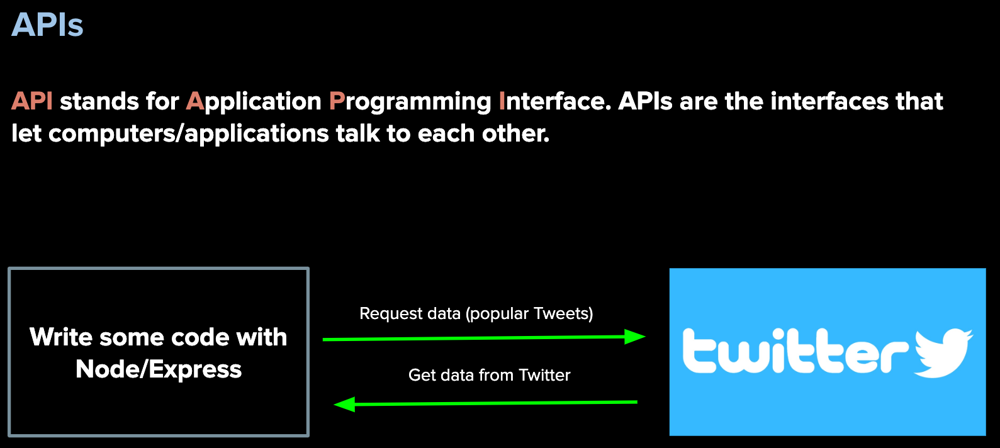
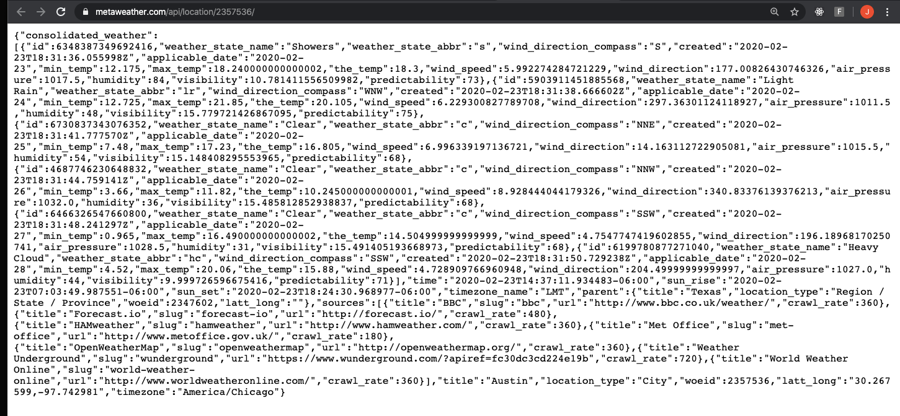
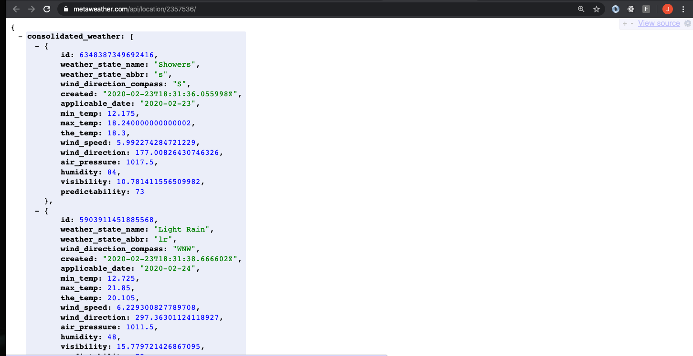

### AUSTIN COMMUNITY COLLEGE
### Web Software Bootcamp

# APIs - Consuming

# Objectives:

1) Introduction/Refresher to APIs
1) Introduction/Refresher to JSON
1) File Structure
1) HTTP requests
    1) Fetch and Promises
1) Possible In-class Demos
    1) Dog Image App 
    1) Movie App 
    1) Lyrics App
1) Review of API consumption
1) Labs

# Learning Path

## <a id='_deadlines' href='#deadlines'>1. Deadlines</a>

1. 05/22/2022 - Readings #1, 2, and 3
  
## <a id='_readings' href='#readings'>2. Readings</a>

1.  <a id='_subRead1' href='#subRead1' style='color: blue'>Welcome to APIs</a>
1.  <a id='_subRead2' href='#subRead2' style='color: blue'>Consuming an API</a>
1.  <a id='_subRead3' href='#subRead3' style='color: blue'>JSON</a>

## <a id='_codervox'>3. CoderVox</a>

## <a id='_projects' href='#projects'>4. Projects</a>

All projects will be done in class

## <a id='_slides' href='#slides'>5. Slide Decks (if applicable)</a>
 
## <a id='_recommended' href='#recommended'>6. Recommended Resources</a>

1. <a id='_projects' href='#subResource1' style='color: blue'>JSON</a>
1. <a id='_projects' href='#subResource2' style='color: blue'>Fetch Documentation</a>

  

# 
Readings

## 
Welcome to APIs

#### <a id='subRead1' href="#_readings"> (back to top)</a>
 

APIs are an important subject and many companies will ask if you know how to use them, so please pay careful attention to the materials this week. 
You will be using everything that you’ve learned up until this point (HTML, CSS/Bootstrap, JS/Node/Express, EJS, etc.)  
  
With APIs, we can now draw data from external resources, e.g. weather data, restaurant reviews, twitter feeds, youtube videos, github repositories and users, names of your congress persons and senators, currency conversion etc.  

One of the projects will involve you building your own restaurant finding application. When a user enters their city, they would get a list of restaurants near their specified location.

Get ready for the excitement!!!

## 
APIs - an introduction

APIs are a fun topic because it really opens up many possibilities for what you can build. Why? 

You can build applications that use data from other applications. Up until this point, all the data we have seen has been self-generated.
But there are many companies and websites that generously offer their data for us to use as developers

The best way to explain what APIs are, is to take a look at some applications that use them:

[Flickr](https://www.flickr.com/) - get photos from a user(s)

[Reddit](https://www.reddit.com/search/?q=jokes) - get the current jokes

[Facebook](https://www.facebook.com/) - send me the status updates, likes, profile pics, and more

[Twitter](https://twitter.com/) - show me the tweets from a certain celebrity

Take a look here - <b>https://www.programmableweb.com/category/all/apis</b>

And here - <b>https://github.com/public-apis/public-apis</b>

## 
<b>TASK:</b>

Consider the following when looking for APIs:

What kind of documentation is provided? How do you use the API? Are there endpoints? Do you need to pay for it? How many calls can you make?

These are all questions (and more) you should be able to answer when deciding which API will work best for your needs.

Fill out the following form:

## [Form - API Search Practice](https://docs.google.com/forms/d/e/1FAIpQLSepNM5NnWjGI1Xxeaesl6ShiQNQ_Ekp4ClmjJBXvBEF4a7iRg/viewform)

## 
Consuming an API

#### <a id='subRead2' href="#_readings"> (back to top)</a>
 

Now that you have a general idea on what APIs are, can you think of any ideas for websites/applications that you might wish to build?

What are some of your inspirations and aspirations?

How do APIs work? 

## 
Consuming an API

Our first exposure to APIs is generally done through 'consuming' an API. But what does this really mean? 

In short, 'consuming' refers to taking data from a third party and using it for our needs. But this comes with limitations:

  1. You must use endpoints specified in documentation. You cannot randomly assign your own endpoints and expect to get data back.
  2. You are only able to get the data back that the third party will allow. If you think Facebook is going to let you have access to phone numbers and email addresses, you are going to be disappointed.
  3. The third party will also determine the amount of data you get back. Sometimes this will be a limit per day, or even per second.
  4. The third party may also ask you to fill out forms, or join newsletters, or even to pay to use their data.

So when designing an API, you need to ask yourself, what kind of data do you need? How often do you need access to it? What are you going to do with it once you have access to it? Are you using it for personal use or do you plan on monetizing it? 

Obviously, companies like Facebook or Twitter are not going to give you direct access to their databases.

That does not mean they cannot share some of their data with us though. The data they send back looks something like this:

    {
      "coord": {
        "lon": -122.08,
        "lat": 37.39
      },
      "weather": [
        {
          "id": 800,
          "main": "Clear",
          "description": "clear sky",
          "icon": "01d"
        }
      ],
      "base": "stations",
      "main": {
        "temp": 282.55,
        "feels_like": 281.86,
        "temp_min": 280.37,
        "temp_max": 284.26,
        "pressure": 1023,
        "humidity": 100
      }
    }

This is called JSON. But what is it?

## 
JSON

#### <a id='subRead3' href="#_readings"> (back to top)</a>
 

JSON is a data format. Data formats define how data is structured when we get it from an API.
There is another data format called XML which is less commonly used nowadays

JSON stands for <b><u>J</u></b>ava<b><u>S</u></b>cript <b><u>O</u></b>bject <b><u>N</u></b>otation, and it has become popular as it is more understandable and compact than XML, a predecessor.

JSON looks just like a JavaScript object, BUT it is actually a string. 

Notice the double quotes around the keys?

    {
      "firstName": "John",
      "lastName": "Smith",
      "isAlive" : true,
      "age": 25,
      "address" : {
        "streetAddress": "21 2nd Street",
        "city" : "New York",
        "state" : "NY",
        "postalCode" : "10021-3100"
      }
    }

An object does not need quotes around the keys UNLESS the key uses a symbol other than underscore ( _ ) or a decimal, or the key contains a space.

Using quaoted with an object is valid code.

Take a look at the JSON coming from Reddit:
https://www.reddit.com/r/news.json

And the JSON that comes from the MetaWeather API:
https://www.metaweather.com/api/location/2357536/

This probably looks something like what is in your browser:

Looks confusing?  

How can we make it more legible?

## 
JSON View

Install `JSONView` from the Chrome Web Store.  To find it, it is best to Google it.

When installed properly, it will make your JSON more legible. If you refresh your browser and try one of the above JSON links, you should see something like this now:

It may not look like it but it is a STRING!!!!

Not an object.

# 
Slide Decks

#### <a id='slides' href='#_slides'>(back to top)</a>

No slides at this time

<!-- These slides are for reference only and will not necessarily be used in class:

1. #### [APIs - Introduction - Weather App](https://docs.google.com/presentation/d/1yMYeVqPawPb50p9BveL7jPfkCFXaqZ6w8SP2NzliKnk/edit?usp=sharing)
1. #### [Consuming APIs - Dog Image and Bitcoin](https://docs.google.com/presentation/d/1TpqNwlLVTzcGCJ-63aMKO0ZmmZDK8VJRZgoWHWb3d_4/edit?usp=sharing)
1. #### [Consuming APIs - Pt2 - Fetch API](https://docs.google.com/presentation/d/1wn8oLdS3l-IPUXBgZrV3DLjQD9RlS5Q8bL8Pi4yKyks/edit?usp=sharing)  -->

# 
CoderVox

#### <a id='codervox' href='#_codervox'>(back to top)</a>

## Tutorial
<h2 style='color: red'>TIME REQUIRED - 0 hours</h3>

No tutorial at this time

# 
Projects

All Projects will be done in class.

If you would like more practice, please reach out to an instructor.

# 
Recommended Resources :

## 
JSON

#### <a id='subResource1' href="#_recommended"> (back to top)</a>
 

Please go through the following tutorials on [W3Schools](https://www.w3schools.com/js/js_json_intro.asp) to get a better idea of what JSON is and how it works. Spend as much time as you need to feel comfortable:

1. JSON Intro
2. JSON Syntax
3. JSON vs XML
4. JSON Data Types
5. JSON Parse
6. JSON Stringify
7. JSON Objects
8. JSON Arrays

## 
Fetch Documentation

#### <a id='subResource2' href="#_recommended"> (back to top)</a>
 

Please check out [MDN](https://developer.mozilla.org/en-US/docs/Web/API/Fetch_API/Using_Fetch) Web docs for more details on Fetch

