# NODE.JS

### TIME REQUIRED: 10 hours

## 
OBJECTIVES

1) <a href="#_internet" id="internet" style="color: blue">How the internet works</a>
1) <a href="#_introNode" id="introNode" style="color: blue">Introduction to node.js</a>
1) <a href="#_npm" id="npm" style="color: blue">Introduction to Node Package Manager and node modules</a>
1) <a href="#_packagejson" id="packagejson" style="color: blue">Importance of package.json</a>
1) <a href="#_builtin" id="builtin" style="color: blue">Introduction to built-in node modules</a>
1) <a href="#_fileSystem" id="fileSystem" style="color: blue">Working with the file system</a>
1) <a href="#_async" id="async" style="color: blue">Asynchronous programming in node.js</a>
1) <a href="#_killing" id="killing" style="color: blue">Killing processes</a>
1) <a href="#_best" id="best" style="color: blue">Utilize best practices</a>
1) <a href="#_projects" id="projects" style="color: blue">Reinforce learning with projects</a>
1) <a href="#_recommended" id="recommended" style="color: blue">Recommended resources</a>

<a href="#objectives" id="_internet">(back to top)</a>

## 
How the Internet Works

## TIME required - 10 minutes
In order to get a rough idea on how the internet works, watch the following video: 

[Packet: How the Internet Works](https://www.youtube.com/watch?v=ewrBalT_eBM)
 

Surprisingly enough, as web developers we do not need to know the nitty gritty details of how the internet works. Things such as networking layers, data transfer protocols, the TCP/IP stack, etc. are things we do not immediately need to know. 

There are whole courses and majors that are dedicated to these topics. However, we do need to know more than the average internet user.

When a user types an address into a browser, such as google.com, they are actually making a request for a website. This is known as an HTTP request. 

When a client (e.g.  a web browser or a mobile app or an IOT device), makes a request to a server, the contents of the response are then sent back to the computer that made the request. 

This is known as the `request-response` cycle.  The client makes a request, and the server sends a response.

Take the following as an example: A user runs a search on `www.google.com`.

When the user submits a URL, the first thing that happens is that your computer needs to know the exact internet protocol (IP) address to send the request to. 

An IP address looks like this .. 213.51.113.13 (4 numbers that range between 0-255 separated by periods).

All IP addresses are unique globally, just like postal addresses in cities and countries. The user's browser sends the request to the internet service provider (aka ISP), e.g. Comcast or AT&T. 

Their server forwards the request to a special kind of server called a Domain Name Server (DNS). There are thousands of DNS all over the world.  Even the ISP may have their own DNS. These keep whispering to each other and try to stay in sync with each other. 

The DNS takes the domain name (in this case, www.google.com) and translates it into an IP address: <b>23.543.35.769</b> and sends that info back to the browser.  

Your computer's operating system stores this information in its memory.  Then your computer makes another request, but this time to the IP address instead of the actual URL.

The ISP finds the fastest path possible to the Google's web server using the specified IP. As noted in the video, this is not a direct journey. 

It requires hopping from server to server until we arrive at the location we requested. And it is not a fixed journey.  It may take any of the thousands of pathways, jumping from server to server.

Once the request reaches the server, the server will figure out what we are asking for: Are you asking for the home page? The sign up page? Contact page?  It does that by reading the URL that was sent. 

The portion after the domain name tells it where to go, e.g. my Google URL for Maps may look like this ... 

https://www.google.com/maps/@30.4281169,-97.6873719,15z. 

This tells the Google web server that I am actually interested in the Google Maps product and I am currently located at the Latitude: 30.4281169 and Longitude: -97.6873719.

Hence the URL contains information on where I wanna go, and the data that I wanna send to the web server.

The server's job is to figure this out and then builds us the right content, often pulling information from other servers and one or many databases. 

The server responds with any combination of HTML, CSS, and JavaScript. 

Below, you will notice different languages used on the back end:

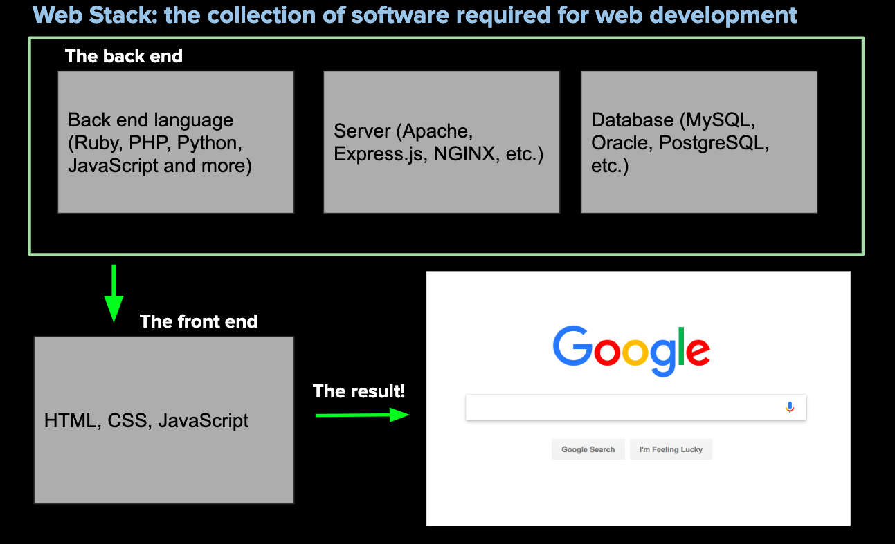

Another example can be seen here:

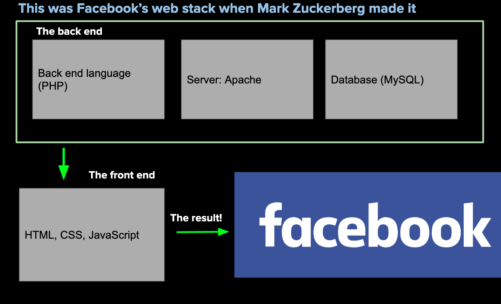

Think of the workflow like this:

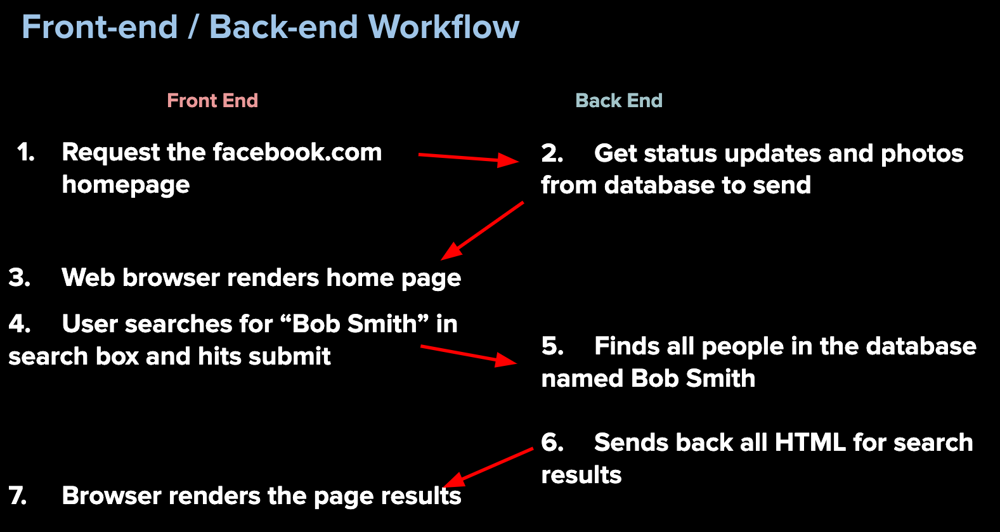

But how do we initiate this workflow? How do we handle the data once it gets back to the front end?

<a href="#objectives" id="_introNode">(back to top)</a>

## 
Introduction to NodeJS

### `What is Node.js?`

Node.js is an open-source, cross-platform, server-side runtime environment built on Chrome's V8 JavaScript engine.

It allows developers to build scalable and high-performance applications by using JavaScript on the server-side. 

In simpler terms, Node.js is a tool that allows developers to create server-side applications using JavaScript.

Traditionally, JavaScript was only used on the client-side to add interactivity to web pages, but with Node.js, developers can now use JavaScript to build full-stack web applications, network applications, real-time applications, and even IoT (Internet of Things) devices. 

It is popular among developers because it is efficient, fast, and can handle a lot of users concurrently.

### `Advantages of Node.js`

Node.js is a type of software that allows developers to build websites and web applications using a programming language called JavaScript. Here are some advantages of using Node.js:

1. Speed: Node.js is very fast because it is built on a technology called event-driven, non-blocking I/O, which means that it can handle many requests at once without getting bogged down.
1. Scalability: Node.js is designed to be scalable, which means that it can handle a large number of users without slowing down. This is especially important for websites and applications that need to handle a lot of traffic.
1. Easy to learn: If you already know JavaScript, then learning Node.js is relatively easy because it uses the same language.
1. Large community: Node.js has a large community of developers who contribute to the development of the software and create libraries and tools that make it even easier to use.
1. Cross-platform: Node.js can run on different operating systems like Windows, macOS, and Linux. This makes it easier for developers to build applications that work on different devices.

Overall, Node.js is a great tool for building fast, scalable, and easy-to-use websites and applications.

### `Understanding the Node.js architecture`

The architecture of Node.js is based on a model called "event-driven" or "asynchronous" programming. 

That means that when you run a Node.js program, it does not run line by line like a typical program. Instead, it uses "events" and "callbacks" to manage tasks.

Say you are running a restaurant and you have multiple orders from different tables that need to be prepared in the kitchen. 

The kitchen staff is like the Node.js program, and the orders are like the tasks that need to be handled. 

Instead of preparing each order one at a time and waiting for it to be finished before starting the next one, the kitchen staff keeps track of all the orders and switches between them as needed to make sure each one is prepared as quickly and efficiently as possible. 

Just like how Node.js handles multiple tasks simultaneously without waiting for one to finish before starting the next one.

Another important part of the Node.js architecture is the "module system." 

This is like a set of tools that developers can use to build their programs. Think of it like a toolbox that has different tools for different tasks, like a hammer for nails and a screwdriver for screws. 

In Node.js, developers can use different modules to do different things, like sending emails or handling user authentication.

Overall, the Node.js architecture is designed to be fast and efficient, using events and callbacks to manage tasks and a modular system to help developers build their programs.

### `Installing Node.js`

As software developers, our ability to read documentation, follow directions, and install libraries in order for us to build our own applications will become even more important than what we have been doing so far.

In order to continue our journey and start working outside the browser, you will need two installs: `nvm` and `node`.

Please use the following tutorial to install nvm and node. 

Keep in mind, if you are a Mac user, you will use the curl command, Window users need to use wget

https://heynode.com/tutorial/install-nodejs-locally-nvm/

Only follow the first 5 steps from the tutorial above.

Please note before you install:

        LTS version is 0.39.0
        If you are a MAC user and currently using ZSH, please see -> 
        https://www.joseverissimo.com/blog/install-nvm-on-zsh-macos-catalina

You will know you have done everything correctly if you get the following versions or greater in your terminal:

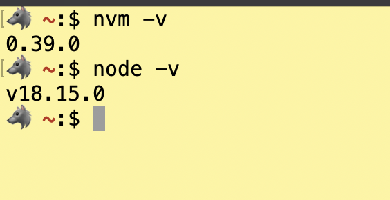

<a href="#objectives" id="_npm">(back to top)</a>

## 
Introduction to Node Package Manager and Node Modules

NPM is a package manager for JavaScript, and it is a central part of Node.js. 
It is an acronym for Node Package Manager.

Packages are libraries that we use with Node.js. 
It is essentially the same idea as using Bootstrap or jQuery, except this allows us to use libraries on the 
back end.

All the packages are centralized at the NPM website. 
You can think of it like the app store for Node packages.

There are over 200,000 packages available (for free!).

Everything is installed through the command line.

Check out the site: https://www.npmjs.com/ 

Search for the these packages:

`cat-me`

`pokemon`

`ejs`

`nodemailer`

`express`

and make sure to note the following from documentation:

1. intall command - should look something like `npm i something.....`
1. weekly downloads
1. version
1. last publish date
1. examples of code to use
1. link to further documentation

Now search for topics you may be interested in such as art, football, cmaping, etc...

All of the above information should be taken into account when installing packages.

Why would you not want to use any of these packages?
Are there red flags? 

<a href="#objectives" id="_packagejson">(back to top)</a>

## 
Importance of Package.json

The package.json file contains metadata about the application. It contains information such as name, description, version number, author, etc. 

More importantly, it also contains a list of the packages that the application depends on. These are known as "dependencies."

When we share repositories of projects, they could depend on 10, 20 or even over 100 external modules. 

Rather than uploading all of those modules, we can instead list them in the package.json file and then have other users download it themselves.

Think of this analogy to explain this: The package.json is a "recipe" and contains a list of ingredients needed to put the app together.

<b><em>NOTE:</em></b> Therefore, every time we create a new application with Node, we want to start including a package.json file.

We can do this manually, but there is a better way through a command called "npm init".

`Guided Project:`

1. Open up a new terminal in your VSC.
1. Create a parent folder called `CatMe`
1. Create a file inside the parent directory called `index.js`
1. Pay attention to your terminal and type `npm init` inside your terminal. Hit `enter` until you get to the last question: Is this Ok?
What do you notice? We will discuss this later.
1. Pay attention to your file structure and hit `enter` one last time. You should see a package.json file created.
1. You should see this structure (icons may be different):

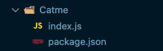

Take a look at the `package.json`. These are the same defaults you saw when you hit `enter` for all the default questions during the `npm init` process.

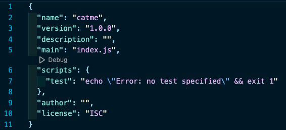

It is not recommended at this time, BUT you can change any of these keys and values. Or instead of hitting `enter` during the `npm init` process, you can actually type in specific responses.

If you want to use all the default values during the `npm init` process you can speed up the process by using `npm init -y` which will automatically use all the defaults and create the package.json without having to hit `enter` all the time.

What does the package.json tell us:

1. Line 2 - name of the package (application) we have created. By default, it will use the paretn directory as the name.
1. Line 3 - version of the package
1. Line 4 - description of the application; used for searches if you deploy to NPM.
1. Line 5 - this is also called the `entry point`. This tells Node which file starts (drives) the application. `index.js` is the default entry point.
1. Line 6 - this tells the application what to do when certain commands are issued. Right now, if you tried to run `npm test`, it would give you an error message.
1. Line 9 - this can be used for the author of the application.
1. Line 10 - this allows you to determine which licensing agreement covers your application, In this case, it is open source and free to use if you deploy to NPM.

We will be adding more to this file. As of right now, it is just basic information about the application, but we have not installed any modules yet.

We need to install the modules needed for our `catme` project.

1. Go to NPM and find the `cat-me` package.
1. Look at how to install. Should be `npm i cat-me`. This is shorthand for `nodepackagemanager install cat-me`
1. Now look at the package.json file. You should see a new "property" called `dependencies`. You should also see the `cat-me` listed as well as the current version. Lines 11 and 12.

Your `package.json` should now look like this:

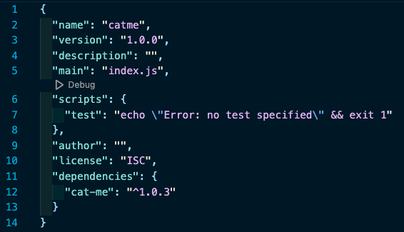

Now look at your file structure. What do you notice?

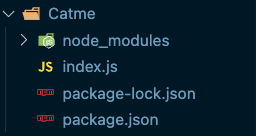

Open up the `node_modules` and look around. Nothing for you to do here. But you should know, when we install a package, the node_modules are folders and files of all the code needed to run the package we installed.

In our case, we installed 22+ folders and files - all needed to run our `cat-me` project. Keep in mind, someone else wrote all this code that we can use for our own use.

You should also notice the `package-lock.json` file.

Think of it this way using the recipe metaphor. The `package.json` file says to make chocolate chip cookies, we need butter, sugar, and flour.

What the `package-lock.json` file says is that for this batch of cookies we used Kerry's salted butter, Imperial sugar from a 5lb bag, and the flour needs to be King Arthur brand. 

The `package-lock.json` file is important because it ensures that anyone who runs `npm install` in your project will get the exact same versions of the dependencies that you have, even if new versions of those dependencies are released. 

This can prevent issues where one developer has a slightly different version of a dependency installed than another developer, causing compatibility issues or bugs.

Now that we have all the materials needed to run our app, we need to write code in the `index.js` file.

In our case, we want to display a random ASCII cat image in our terminal window.

Inside the `index.js` file, we need the following code:

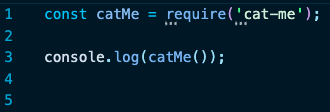

Even though we installed `cat-me` package, we have to tell our application we want to use it.

Line 1 - `require()` also means "import." When we require a package, we are telling our app we need to use all the code associated with this package.

`require()` is a method and it returns something. In our case it returns an anonymous function which we are assigning to a variable called `catMe`. This is common practice - naming the variable in a way related to the parent level package.

We use `const` because we do not want our variable to be accidentally overwritten. 

Line 3 - due to associativity, we can invoke the function returned to our variable as `catme()` which is passed into our logging mechanism. This returns a random ASCII cat image. However, it just "sits" in our app, doing nothing.

By using `console.log()`, we can see what was returned and display it in our terminal window.

We can run our application with the following command in our terminal (make sure you are in the parent directory):

`node index.js`

which returns a random cat image similar to this:

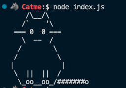

CONGRATULATIONS!! You have built your first Node application. 

Keep in mind, this is as simple as our apps are going to be. Going forward, our apps will grow in complexity. However, EVERY Node project is going to start with the exact same process as a best practice:

1. Create a parent directory
1. Create an `index.js` file inside parent directory
1. Use `npm init <flags>` to create the `package.json` file
1. Install any dependencies needed for your application
1. Write code inside application starting with the `index.js` file
1. Use `node <name of entry point file>` to run your application

<a href="#objectives" id="_builtin">(back to top)</a>

## 
Built-in Node Modules

So far, we have discussed how to install third-party packages (modules) using NPM. However, there are many modules built into Node we can use for various functionality.

Some of the more common modules are:

1) Crypto 
1) HTTP
1) Events
1) Path 
1) FS

We will experiment with a couple of these, but please make sure to check out the documentation for [Node](https://nodejs.org) and see what else you may be able to do.

`Crypto` 

The crypto module is a built-in module in Node.js that provides cryptographic functionality, which means it allows you to perform encryption and decryption of data.

Encryption is a process of converting plain text into a secret code that can only be read by someone who has the key to decrypt it. 

Decryption, on the other hand, is the process of converting the secret code back into the original plain text.

The crypto module provides different types of encryption algorithms, such as AES (Advanced Encryption Standard), DES (Data Encryption Standard), and RSA (Rivest-Shamir-Adleman), to name a few. 

These algorithms use complex mathematical formulas to scramble and unscramble data.

The crypto module can be used for a variety of purposes, such as securing passwords, protecting sensitive data, and ensuring the integrity of data. 

It is also commonly used in web development to create secure connections between a client (such as a web browser) and a server (such as a web server), which helps prevent sensitive information from being intercepted by hackers.

Overall, the crypto module is an important tool for keeping data safe and secure in a variety of contexts.

`HTTP`

The http module is a built-in module in Node.js that allows you to create web servers and handle HTTP requests and responses.

HTTP stands for HyperText Transfer Protocol, which is a set of rules that govern how data is transferred over the internet. 

Every time you visit a website or make an API call, you are using HTTP to communicate with a server.

The http module provides functions that allow you to create a web server, listen for incoming HTTP requests, and send HTTP responses back to the client. 

For example, you can use the http module to create a web server that responds to requests for specific URLs, such as serving up a web page or returning data in JSON format.

The http module also allows you to handle different types of HTTP requests, such as GET requests (which are used to retrieve data) and POST requests (which are used to send data to a server). 

This is important because different types of requests require different types of handling.

Overall, the http module is an important tool for building web applications and APIs in Node.js. 

By providing the ability to create web servers and handle HTTP requests and responses, it enables developers to create dynamic and interactive web applications that can be accessed from anywhere in the world.

`Events`

The events module is a built-in module in Node.js that allows you to create and handle custom events in your code. An event is basically a signal that something has happened. 

For example, when you click a button on a website, that button click generates an event. Events can also be triggered by other actions, such as the completion of a file download or the receipt of new data from a server.

The events module allows you to create your own custom events and write code that responds to those events. 

For example, you could create an event in your code called "newMessage" that is triggered whenever a new message is received from a server. You could then write code that listens for the "newMessage" event and updates the user interface to display the new message.

The events module provides a set of functions that allow you to create:

1. event emitters (objects that generate events) 
1. event listeners (objects that respond to events). 

These functions include:

1. "on" (which registers a listener for a specific event
1. "emit" (which triggers an event)
1. "removeListener" (which removes a previously registered listener).

Overall, the events module is an important tool for building event-driven applications in Node.js. 

By allowing you to create and handle custom events, it enables you to build code that is more flexible, modular, and responsive to user actions and other events.

`Path`

The path module is a built-in module in Node.js that provides utilities for working with file and directory paths.

A path is simply a string that represents the location of a file or directory on a computer's file system. 

For example, "C:\Users\username\Desktop\file.txt" is a path that represents a file called "file.txt" on the desktop of a user named "username" on a Windows computer.

The path module provides functions that allow you to manipulate and work with paths in your code. 

For example, you can use the path.join() function to concatenate multiple path segments together and create a valid path, regardless of the operating system your code is running on.

The path module also provides functions that allow you to extract specific parts of a path, such as the file extension or the directory name. 

This can be useful when you need to perform operations on specific files or directories in your code.

Overall, the path module is an important tool for working with files and directories in Node.js. 

By providing utilities for working with paths, it makes it easier for developers to write code that can access and manipulate files and directories on a computer's file system.

`FS`

The fs module is a built-in module in Node.js that provides utilities for working with the file system.

The file system is the part of a computer's operating system that manages files and directories. 

When you save a file to your computer, it is stored on the file system. The fs module provides functions that allow you to read, write, and manipulate files and directories on the file system.

For example, you can use the fs.readFile() function to read the contents of a file, or the fs.writeFile() function to write new data to a file. 

You can also use the fs.mkdir() function to create a new directory, or the fs.rmdir() function to delete an existing directory.

The fs module provides a wide range of functions for working with files and directories, including functions for copying files, moving files, renaming files, and more. 

It also includes functions for working with streams, which are a way of reading or writing large amounts of data in smaller chunks.

Overall, the fs module is an important tool for working with files and directories in Node.js. 

By providing utilities for reading, writing, and manipulating files and directories, it makes it easier for developers to build applications that interact with the file system.

<a href="#objectives" id="_fileSystem">(back to top)</a>

## 
Working with the File System

In order to practice with buit-in node modules, it is time to go through a semi-guided project to see the power of node.

1. Create a new project called `encoded`
1. Add your entry point and make sure to use `npm init` to create your `package.json`
1. Since we are using built-in modules, we DO NOT install anything. They are already available to us.
1. Write the following code in your index.js:

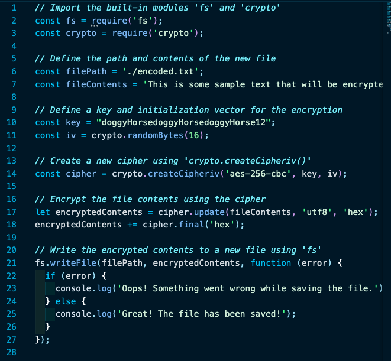

This code shows how to use the crypto module's `createCipheriv()` method to encrypt a message using an initialization vector (IV) in addition to the encryption key. 

The fs module is then used to write the encrypted contents to a file at the specified path.

The `createCipheriv()` method takes three arguments: the encryption algorithm (aes-256-cbc), the encryption key (key), and the initialization vector (iv).

The `cipher.update()` method is used to encrypt the contents of the file in chunks, and `cipher.final()` is used to complete the encryption process.

Finally, the encrypted contents are written to a new file at the specified path using the `fs.writeFile()` function. If an error occurs during the writing process, the code will log an error message to the console.

Line 10 needs to be 32 characters (bytes) long. In this case, it is hard coded but you can also use something like `const key = crypto.randomBytes(32);` to create a random 32-byte key.

Try doing this with a text file hard coded inside the directory, then use the `fs` module to read the content from the file and then encode to an output file.

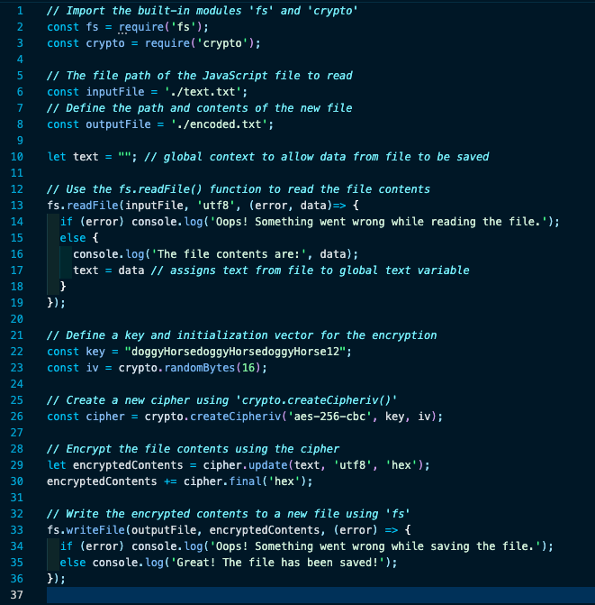

This is just the tip of the iceberg of what you can do with built-in modeules.

Experiment with the `fs` module and see if you can create files and folders using just the index.js file.

<a href="#objectives" id="_async">(back to top)</a>

## 
Asynchronous Programming in Node.js

Asynchronous programming in Node.js is like ordering food at a restaurant. 

Imagine you're sitting at a table in a busy restaurant, and you want to order some food. You tell the waiter what you want, and they write it down and take the order back to the kitchen.

While you are waiting for your food, the waiter does not just stand there staring at you. They might go check on other tables, refill drinks, or take more orders from other customers. 

The waiter is able to do multiple things at once, which is what makes them efficient.

In Node.js, asynchronous programming works in a similar way. 

When you make a request to do something, like read a file or send a request to a web server, Node.js doesn't stop and wait for the response before moving on to the next task. 

Instead, it goes ahead and starts working on the next task in the queue.

This is like the waiter taking other orders while your food is being prepared in the kitchen. 

Once your food is ready, the waiter brings it back to your table and serves it to you. Similarly, once Node.js gets a response back from a task it was working on, it will send that response back to your code and continue working on the next task in the queue.

This allows Node.js to handle multiple tasks at the same time, which can make your code faster and more efficient. 

Just like a busy restaurant with a good waiter, Node.js can handle many requests at once and keep everything running smoothly.

Take a look at the following code. What do you expect the result to be? Why?

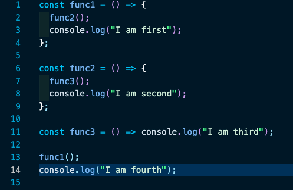

Try it out. 

Will it make a difference this way?

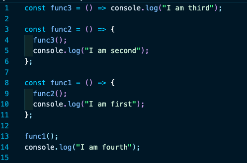

What is happening here?

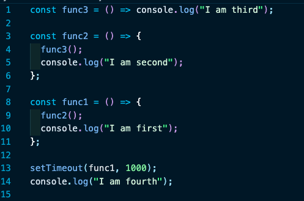

This code defines three functions func1, func2, and func3, and schedules the execution of func1 using setTimeout.

When func1 is executed after a delay of 1000 milliseconds (1 second), it calls func2, which in turn calls func3. func3 logs the message "I am third" to the console, func2 logs "I am second", and finally func1 logs "I am first".

Meanwhile, outside of the function definitions, the message "I am fourth" is immediately logged to the console.

Therefore, the output of the program will be:

        I am fourth
        I am third
        I am second
        I am first

<a href="#objectives" id="_killing">(back to top)</a>

## 
Killing Processes

### IMPORTANT: 
When working with backend technologies such as express (or servers in general), it is important to remember a couple concepts during the development phases:

1) Every time you make a change to your index.js (or whatever you have called your server file) you MUST stop the node process and restart it.

1) You can do this by holding down the control key on your computer and tapping the c key <b>(CTRL + C)</b>. This will stop the node process from running.

1) Restart your node process as you have previously done.

1) If you are trying to run your node process and you get an error similar to  this:

    `Error: listen EADDRINUSE`

This means you have a server currently running on that current port. You need to find where that process is running and stop it.

    a) Go to your terminal and type the following command where index.js represents the file you believe is running (could be index.js or server.js): 

            ps aux | egrep index.js

    b) This will give you a list of files currently running that match index.js and look something similar to this:

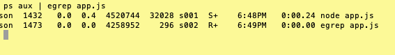

    What you are looking for is the process number that is running. In the above example you will see 1432 and 1473. If you look at the time stamps, you will see at 6:49pm is when you ran the egrep command which means the other process is probably the one you want.

NOTE: you may have MANY files that end up in your results and may take you more time to figure out the correct process

Use the following command to end the process:

	kill 1432

You should now be able to restart the app you want.

For more detailed information, please refer to   

https://www.linux.com/tutorials/how-kill-process-command-line/  

for a quick tutorial on killing processes. 

<a href="#objectives" id="_best">(back to top)</a>

## 
Best Practices

`Creating a Node Project`

1. Create a parent directory
1. Create an `index.js` file inside parent directory
1. Use `npm init <flags>` to create the `package.json` file
1. Install any dependencies needed for your application
1. Write code inside application starting with the `index.js` file
1. Use `node <name of entry point file>` to run your application

<a href="#objectives" id="_projects">(back to top)</a>

## 
PROJECTS

There projects will help you gain a better understanding of Node and the dev tools to be used when working on the backend.
There is no front-end, so most of these projects are done with dev tools and your terminal.

## 
Node and NPM

#### <a id='project2' href="#_projects"> (back to top)</a>
 

The objective here is to learn the basics of Node.js. We are going to use Node.js which you should have already installed on your laptop and now we are going to get some practice using NPM. 

We will be using NPM to install packages in our applications, so this will be useful for us very soon.

Create a new parent folder called `npmProjects`. We will be using it for all of the tasks in this project.

## Task #1 : NPM INIT
This task is designed to help you gain some experience with using the package.json file. 

Review the documentation for package.json here: https://docs.npmjs.com/getting-started/using-a-package.json

Create an empty folder and cd into it in your terminal. Run npm init. It will ask you to fill out some data regarding your application.

Be familiar with what each field requires and what they mean.

Repeat the same process by creating another blank folder, and running `npm init` again.

You may delete these folders.

Going forward, until further notice, you should ALWAYS use `npm init` when building an application that uses Node.js.

## Task #2 : HEARTS

Here is a fun and simple NPM package you can use to create ASCII hearts in your terminal!

1. Take a look at this package: https://www.npmjs.com/package/ascii-heart

2. Read the documentation.

3. Create a folder called <code>HeartsProject</code>

4. cd into that folder.

5. Create a file called `index.js`. 

6. Run `npm init` (NOTE: last reminder to do this.)

7. Put your code in there, and get some hearts displaying in your terminal!

8. Try the parameters. Try making bigger and smaller hearts.

9. Use different emoji characters.

## Task #3 : Marvel Characters

Here is another simple package that allows you to randomly get a marvel character name:

1. Check out the documentation for marvel-characters package here:
https://www.npmjs.com/package/marvel-characters 

2. Read the documentation.

3. Create a folder called `SuperProject`

4. cd into that folder.

5. Create a file called `index.js`. 

6. What do you do here..........??? Do not forget!!!

7. Install module locally NOT globally. DO NOT use the global flag (-g).

8. Write code in index.js that will:

        a. Get a random character to show in the terminal.

        Using various array methods:

        b. Display the number of characters in the database

        c. Display only characters whose names start with "Man" in your terminal, or an error message if does not exist.
        
        d. Display "Iron Man" in your terminal, or an error message if does not exist

        e. Display "Batman" in your terminal, or an error message if does not exist

9. Results should look something similar to this: 

        🐺  SuperProject:$ node index.js 
        Maria Hill
        # of characters in the db:  1252
        [
        'Man-Thing',
        'Man-Wolf',
        'Mandarin',
        'Mandrill',
        'Mandroid',
        'Manta',
        'Mantis'
        ]
        [ 'Iron Man' ]
        No matches found

## Task #4: CASUAL

1. Navigate to this package: https://www.npmjs.com/package/casual

2. `Casual` is a fake data generator. It generates random names, addresses, etc. for us quick and easy! <b>NOTE:</b> great to use later on for generating fake data for a database.

3. Read the documentation.

4. Create a file called `index.js`. 

5. Create a simple program that outputs the following statement in the terminal. Use casual to create the (fake data):

        Hello there (name)! 
        How was your trip to (country)? 
        Did you get to visit (city)? 
        I sure do hope you had a wonderful time. 
        Is your phone number still (phone number)?
        I will try to give you a call sometime. By the way, I want to send you a fresh loaf of bread at your address of:
        
                (address). 
                
        Well, I will see you soon. I will be visiting sometime before (month). 
        Until then, farewell!

## Task #5: LOG.PETS & ANIMALS

Check out both https://www.npmjs.com/package/log.pets and https://www.npmjs.com/package/animals

1. Create a folder called AnimalsProject with a file called `index.js` and use npm to install both packages.

2. Get a random animal's name to appear in the console using the "animals" package.

        🐺  AnimalsProject:$ node index.js 
        rook
        🐺  AnimalsProject:$ node index.js 
        guinea-pig
        🐺  AnimalsProject:$ node index.js 
        cheetah

3. Get a lion ascii art to appear using the "Log.pets" package.

        AnimalsProject:$ node index.js 
        horse
                  .~ ~ ~.
                (  o,,,o  )
               (   ). .(   )
                \  { v }  /
                  ~ `v' ~

4. Can you use them both together so that the animal names from the "animals" package appear on the zoo sign from the Log.zoo method in the "Log.pets" package.

It should look something like this in your terminal (different names each time you run): 

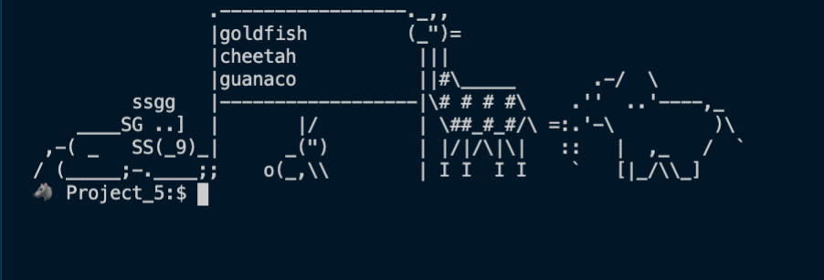

5. Can you display the number of animals available for the generator?

        # of animals in generator: ????

6. Using array methods, how many animals start with the letter 'G', or display an error message if none found?

        # of animals starting with G:  No matches found

7. Using array methods, and the "G" from above, how can you display number of animals starting with that letter, or display an error message if none found?

        # of animals starting with G:  19

## Task #6: READLINE-SYNC part 1

1. Go to this package: https://www.npmjs.com/package/readline-sync

2. Read the documentation. 

3. Install and use it.

4. Using node and the readline-sync package, create a file that asks three questions in the Terminal:

        "What is your name?"

        "What is your favorite food?"
        
        "What is your favorite drink?"

5. When you run the file, the program should respond with the sentence:

        "Hi ____, your favorite food is _____ and your favorite drink is ____."

## Task #7 : READLINE-SYNC part 2

1. Using node and the readline-sync package again, create a file that asks,

 	    "How spicy would you like your tacos?"

2. The user should be presented with a list of choices:

        'spicy', 
        'very spicy', and 
        'so spicy, you won't be able to feel your face'.

3. The terminal should then respond with the question:

        "Ok, so you want your tacos to be ____. Are you sure about this?"

4. The user should then be given the choices to respond, 'yes' or 'no'.

5. If they choose 'yes', the output should be:

        "Ok, we will have your order right out."

6. If they choose 'no', the output should be:

        "What's the matter? Can't handle the heat?"

<b>NOTE:</b> you will want to use the built-in keyInSelect method in readline-sync to do this task. Refer to the documentation for an example.

<a href="#objectives" id="_recommended">(back to top)</a>

## 
Recommended Resources

 

### 
<u>TECH STACKS - STACKSHARE</u>

Take a look at <a href="https://stackshare.io">stackshare.io</a> in order to see what types of technology stacks companies use:

    https://stackshare.io/airbnb/airbnb

    https://stackshare.io/pinterest/pinterest

    https://stackshare.io/netflix/netflix

Notice anything? Recognize any of the technologies? You should see some of the same technologies you have been learning as well as a few you will learn in the near future.

### 
<u>NODE.JS DOCUMENTATION</u>

Please bookmark for futher reference:

[Official Node Documentation](https://nodejs.org/en/docs/)

### 
<u>FILE STRUCTURES CHEAT SHEET</u>

<b>File&nbsp;&nbsp;Structures</b> (order may vary):

	Basic Backend:
		PARENT FOLDER
                index.js
                package.json
                package-lock.json
                node-modules (folder)

### 
<u>Important Commands</u></a>

<b>(CTRL + C)</b> - kills a running process

<b>node {fileName}</b> - runs the fileName; if there are any changes to fileName then user must kill the process and then restart

<b>nodemon {fileName}</b> - runs the fileName; user does not need to restart - done automatically

<b>npm init</b> - creates a package.json file to be used as a "blueprint" on how to run the application

<b>ps aux | egrep index.js</b> - command line statement that allows the user to discover which processes are running in terminal	with an index.js

<b>rs</b> - forces a restart of nodemon

<!-- Introduction to Node.js:
  What is Node.js?
  Advantages of Node.js
  Installing Node.js and NPM
  Understanding the Node.js architecture

Node.js Modules:
  Understanding Node.js modules
  Built-in modules in Node.js
  Creating and using custom modules
  Module.exports and exports

Asynchronous Programming in Node.js:
  Understanding Asynchronous programming in Node.js
  Callback functions
  Promises and async/await
  Handling errors

Working with the File System:
  Working with files and folders
  Reading and writing files
  Creating and deleting files and folders
  Understanding file streams

Working with Node.js HTTP:
  Understanding HTTP protocols
  Creating a simple HTTP server
  Making HTTP requests
  Parsing and handling HTTP responses

Working with Databases:
  Introduction to databases
  Connecting to databases
  Querying databases
  Working with MySQL, MongoDB or other popular databases
  
Working with Express.js:
  Understanding the basics of Express.js
  Creating an Express.js application
  Configuring routes
  Understanding middleware
  Templating engines

Authentication and Authorization:
  Introduction to authentication and authorization
  Implementing authentication and authorization in Node.js
  Working with Passport.js
  Using JSON Web Tokens (JWT) for authentication

Deploying Node.js Applications:
  Preparing an application for deployment
  Hosting options
  Deploying an application to a cloud provider

Testing Node.js Applications:
  Understanding testing concepts
  Using Mocha and Chai for testing
  Unit testing, integration testing and end-to-end testing

Debugging Node.js Applications:
  Introduction to debugging
  Debugging with console.log()
  Debugging with the Node.js debugger
  Debugging with VS Code

Best Practices:
  Code organization and structure
  Naming conventions
  Handling errors
  Writing clean and maintainable code
  Version control with Git

Project:
  Creating a complete Node.js application from scratch
  Applying the concepts learned in the course
  Working with databases, authentication, and authorization
  Deploying the application to a cloud provider. -->
