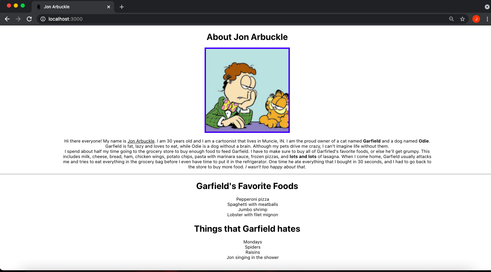
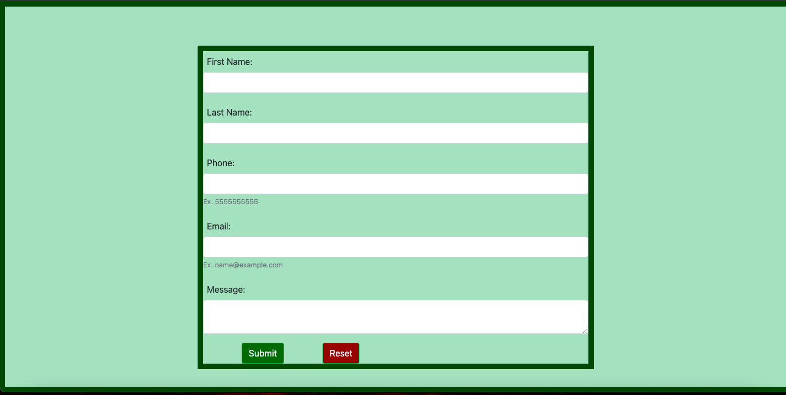

### AUSTIN COMMUNITY COLLEGE
### Web Software Bootcamp

# REACT

# Objectives:

1. Discuss what is React and why it is important
1. Use create-react-app (or other installation options) to build a basic app template
1. Understand the difference between HTML and JSX
1. Be able to pass props from one component 'down' to another
1. Be able to set state of a component as needed
1. Use React-Router to navigate to different components as needed
1. Basic (re)understanding of CSS and how it behaves differently with React - Router
1. Use basic libraries such as Fetch and Axios in order to consume APIs
1. Experiment with different ideas in order to complete projects
1. Use Chrome React Dev tools to assist in all aspects of React development
1. Connect to Mongodb with your React app (if time)

You are encouraged to attempt projects ahead of time but please keep in mind that they are designed to be learned IN ORDER; they build upon knowledge from previous lectures.

As for class attendance, it is extremely important to attend "in person" as the bulk of information requires lectures, code-alongs, and asking questions. 

You will probably notice right away that we are no longer dealing with a handful of files but rather many folders with many files in each folder. 

This can get very confusing very quickly if you miss out on a lecture. 

For example, what roles do the following files play in React: `index.html`, `index.js`, and `index.css`? Yes, we will be using all three PLUS many, many more!!!

And remember, this is a marathon and not a sprint. There is a lot of information you are about to be exposed to so take a breath, work the projects, 

ASK questions and enjoy the new world you are about to enter.

# Learning Path

## <a id='_deadlines' href='#deadlines'>1. Deadlines</a>

1. 06/10/23 - Decide on a React tutorial and START -> Recommended Resources #3 (or any others you may have researched).
1. 06/17/23 - Readings #1 and #2 done before class
1. 06/21/23 - Readings #3 - Props before class
1. 06/24/23 - Readings #4 before class
1. 07/01/23 - Readings #5 before class
1. 07/05/23 - Readings #6
1. 07/08/23 - Complete your React tutorial
1. 07/15/23 - Done with all React Projects (#1- #4)
1. 07/15/23 - Choose one of the projects (1-4) and have it converted into class-based components
  
## <a id='_readings' href='#readings'>2. Readings</a>

1.  <a id='_subRead1' href='#subRead1' style='color: blue'>Install Dev Tools</a>
1.  <a id='_subRead2' href='#subRead2' style='color: blue'>React - Intro</a>
1.  <a id='_subRead3' href='#subRead3' style='color: blue'>React - Props</a>
1.  <a id='_subRead4' href='#subRead4' style='color: blue'>React - State</a>
1.  <a id='_subRead5' href='#subRead5' style='color: blue'>React - Routing</a>
1.  <a id='_subRead6' href='#subRead6' style='color: blue'>React - APIs</a>

## <a id='_slides' href='#slides'>3. Slide Decks (if applicable)</a>
  

## <a id='_codervox' href='#codervox'>4. CoderVox</a>

## <a id='_projects' href='#projects'>5. Projects</a>

1. <a id='_projects' href='#project1' style='color: blue'>Projects #1: Jon Arbuckle</a>
1. <a id='_projects' href='#project2' style='color: blue'>Projects #2: Steve Jobs </a>
1. <a id='_projects' href='#project3' style='color: blue'>Projects #3: Movie Splash Page</a>
1. <a id='_projects' href='#project4' style='color: blue'>Projects #4: Breakfast App</a>
1. <a id='_projects' href='#project5' style='color: blue'>Projects #5: BONUS - Form with Mongo</a>
1. <a id='_projects' href='#project6' style='color: blue'>Projects #6: BONUS - MERN</a>
 
## <a id='_recommended' href='#recommended'>6. Recommended Resources</a>

1. <a id='_projects' href='#subResource1a' style='color: blue'>React</a>
1. <a id='_projects' href='#subResource1' style='color: blue'>Babeljs</a>
1. <a id='_projects' href='#subResource2' style='color: blue'>React - Tutorials</a>
1. <a id='_projects' href='#subResource3' style='color: blue'>APIs with React</a>
  

# 
Readings

## 
Install Dev Tools

#### <a id='subRead1' href="#_readings"> (back to top)</a>
 

Welcome to React!

React is a front end library that was created by Facebook in 2013. It has since exploded in popularity in the web/mobile developer community.

### INSTALLING REACT DEV TOOLS FOR CHROME

Before continuing, you should install a dev tool extension for Chrome that will make your job easier when working with React. 

Please install a Chrome extension called ‘React Dev tools’ to help you out.

In order to better utilize all our resources, and to ensure we have the best tools going forward, it will be important to understand how React works ‘under the hood.’

At first, this will not make any sense and this tool may not be used. But when we start delving into ‘props’ and ‘state’, being able to see these in your browser will be invaluable.

`NOTE:` Going forward, you need to use Chrome as much as possible, especially for react projects:

1. Open Chrome
1. Click on -> Windows tab
1. Click on -> Extensions
1. Search for “React Developer Tools”
1. Install

## 
React - Intro

#### <a id='subRead2' href="#_readings"> (back to top)</a>
 

What is React and why should we use it? 

React is great for building single page applications and mobile apps (React Native). React has become very popular and is maintained by Facebook. 

In fact, if you have the Chrome React dev tool extension installed, you should see Facebook is built with React, as well as Instagram.

Other organizations that use React include Airbnb, Apple, and Netflix. If you go to Indeed.com, you should see tens of thousands of jobs across the world looking for developers with React experience.

Check out this [article](https://medium.com/@TechMagic/reactjs-vs-angular5-vs-vue-js-what-to-choose-in-2018-b91e028fa91d) comparing the 3 top popular frameworks/libraries:

React  
Angular 
Vue

 

React is a view library using something called “components." Everything in React is a component, and you can frequently reuse these components. 

Very similar to how EJS used templates that could be reused and allowed for passing of data through those templates.

Building an entire application in a single component is not a great idea as it can grow huge, complex, and difficult to maintain and test. 

It is a good idea to start looking at applications using the idea of components. By breaking an app down into components allows the app to be easier to test and easier to keep track of what functionality goes where.

React components are written using JSX. It stands for “JavaScript XML”.

    const element = (
            

                    <h1>Hello</h1>
                    <h2>Good to see you here</h2>
            

    )

This is an example of JSX. It looks like HTML. However, when it is run, this code is converted to pure JavaScript commands by Babel. 

Babel is a transpiler, which converts JSX into JS, among other things it can do. Then React converts the JS into plain HTML embedded with dynamic data, which the browser can interpret .

Babel is a transpiler.  It is a program that converts code in one language into another language (e.g. convert JSX to ES5).  

Also, in recent years, JavaScript developers have created newer versions of the JavaScript language with new features (e.g. ES6).  However, not all web browsers recognize these new features.

Babel takes the new JavaScript code (ES6) and convert it into the old JavaScript code so that all web browsers can understand it.

https://babeljs.io/

## 
React - Props

#### <a id='subRead3' href="#_readings"> (back to top)</a>
 

Props is how we pass properties (variables) from one component to another. 

How do we know this is actually happening? We can use certain tools available through Chrome to assist with our development.

When using props, it is important to understand how destructuring works for objects and array.

[MDN JavaScript Destructuring](https://developer.mozilla.org/en-US/docs/Web/JavaScript/Reference/Operators/Destructuring_assignment)

It is also important to understand basic mapping of arrays.

[Array.map() method](https://developer.mozilla.org/en-US/docs/Web/JavaScript/Reference/Global_Objects/Array/map)

## 
React - State

#### <a id='subRead4' href="#_readings"> (back to top)</a>
 

Any time there are changes to data,  or changes to the 'state' of your page, we need to be able to make sure your page updates.

Remember, props cannot change. However, state can, so how do we utilize this to our advantage?

After a more in depth look at props, and how to map various data that we hard code, we can now change the state (change the data) that is passed.

We can use a a simple syntax to show how state is created (this.state), and changed (this.setState).

Go to this link and BUILD the tic-tac toe game: (https://reactjs.org/tutorial/tutorial.html)

Though your instinct may be to think this is not worth your time, I assure you it is a valuable resource to understanding props and state.

## 
React - Routing

#### <a id='subRead5' href="#_readings"> (back to top)</a>
 

When dealing with links and routing, React has a special way of making sure the correct components load.  This is done with React-Router.

[React Routing Tutorial](https://www.tutorialspoint.com/reactjs/reactjs_router.htm)

Also, we need to up our understanding on the way CSS works with different components and the way they are mounted.

[W3Schools React - CSS](https://www.w3schools.com/react/react_css.asp)

## 
React - APIs

#### <a id='subRead6' href="#_readings"> (back to top)</a>
 

Currently, you can build a basic react app and you can pass props and state with your components IF you supply the data.

But what if we need the data from an outside source? 

Using fetch

[Fetch with React](https://reactjs.org/docs/faq-ajax.html)

or axios

[NPM axios](https://www.npmjs.com/package/axios)

you can build a basic app that consumes data from a third party and display the results with basic component building.

# 
Slide Decks

#### <a id='slides' href='#_slides'>(back to top)</a>

These slides are for reference only and will not necessarily be used in class:

All slides will be found as needed in the General Resources.
## React
1. [Intro to JSX and React](https://docs.google.com/presentation/d/1mNF8MRYFl9_d7gVFAhSEw3uSrWkB8nxkV_HkeWcuwOo/edit?usp=sharing)
2. [React - Vite, DevTools, Props](https://docs.google.com/presentation/d/1Vxd0CNKxwLmpUM6RbGSEV4eEYnMq_LkyZa7CiYZtivs/edit?usp=sharing)
4. [React - State](https://docs.google.com/presentation/d/13U1Vsbol849q9wETeIUwkPIiBsS5j0KdzC5OR94-Og4/edit?usp=sharing)
5. [React - Router](https://docs.google.com/presentation/d/1gAubitIQbH7hA1OzYhthJyAQqaYphG8OdF8SYdowr0k/edit?usp=sharing)
6. [React - Movie API](https://docs.google.com/presentation/d/1yjJi5r8ZmMEw-sOgwaieFTy4CgdF4hXGSW-tyGsdn08/edit?usp=sharing)

# 
CoderVox

#### <a id='codervox' href='#_codervox'>(back to top)</a>

## Tutorials

There is no CoderVox tutorial for this module.

However, please look at the Recommended Resources -> <a id='_projects' href='#subResource2' style='color: blue'>React - Tutorials</a> 
 and pick ONE to work with.

As you get more comfortable, feel free to try others or mix and match. 

In the meantime, it is best to pick one tutorial and work through it before trying another.

# 
Projects

## 
Project #1: Jon Arbuckle

#### <a id='project1' href="#_projects"> (back to top)</a>
 

Your goal is to rebuild the Jon Arbuckle site you built back in the HTML module.

1) Convert the Jon Arbuckle HTML project into React
1) Make sure you alter the code so the the tab in your browser says 'Jon Arbuckle'
1) Add a `favicon` of your choice. 

- You may have to do research on how to make this happen:  
    [Favicons and React](https://medium.com/@jenniferdobak/the-public-folder-and-favicons-in-create-react-app-8dc2cc1d492b)
    
1) Make sure to read the very last line of the article above. If this is the case, where do you need to add your image?
1) CSS - add a border to the image, and have the introduction under the image set so it is 75% of the width of the browser.

## 
Project #2: Steve Jobs

#### <a id='project2' href="#_projects"> (back to top)</a>
 

Your goal is to rebuild the Steve Jobs site you built back in the HTML module.

1) Convert the Steve Jobs HTML project into React
1) Build an object inside the `App.js` that contains the links and descriptions for the videos
1) Build a component called `Videos.js`
1) Iterate through your links object in a way that will display all three videos with their descriptions. `NOTE:`You CANNOT hard code the videos in your `App.js`, they need to be passed as props into the `Videos.js` component.
1) You will also need to build your descriptions within your iterator.
1) You may encounter MANY issues with YouTube videos. These are minor issues that can be fixed if you use Google and pay detailed attention to your links. 
1) Pay attention to your dev tools inside Chrome - they will help guide you and let you know what the errors are.

## 
Project #3: Movie Splash Page

#### <a id='project3' href="#_projects"> (back to top)</a>
 

Your task is to build a React app with a movie theme. This project is going to push your knowledge from all previous projects. 

It will be a challenge. Most of the content has been covered in class, but you are still going to have to do some research and test creative code to get it to work. 

There are MANY ways to do this, so please do not get bogged down with how others do it. Find your own way.

End result should look something like this:

#### Task #1 - Create App

1. Create an app called `movies` using `create-react-app`

#### Task #2 - Create an external data file

1. Since we are not using an API or database, you are going to have to hard-code your own 'fake' data
1. Create a file called `data.js` inside your src folder
1. Your file needs to include `title`, `director`, `cast`, and `image` in "name:value" pairs.
	1. Your file is going to be an array with 3 objects in it:
		1. Each object is going to have `title` as a string value
		2. Each object is going to have `director` as a string value
		3. Each object is going to have `image` as a path value (locally or external)
			1. This value should lead to an actual image that will be displayed
		4. Each object is going to have `cast` as an ARRAY with a MINIMUM of 2 actors from the movie

#### Task #3 - Build Components

1. Re-arrange your App Component
	1. You should only have one component imported in your App.js -> Movie Component
	1. You will import data from an external javascript file created above
	1. Data will be passed down to ALL other components via props
2. Build a Movie Component
	1. Movie component should be comprised of a Poster component and an Info component
	2. [Iterating through arrays in React - StackOverflow](https://stackoverflow.com/questions/29149169/how-to-loop-and-render-elements-in-react-js-without-an-array-of-objects-to-map)
	3. You are going to have to use your Javascript knowledge, in-class projects, creativity, research  and trial-and-error to make it work - there are many ways to get the same result.
3. Build a Poster Component
	1. Will return an image using props passed down from App.js
	2. The `alt` attribute will use `title` that is passed down as props from App.js
4. Build an Info Component
	1. Will use props passed down from App.js
	2. Will return title, director, and cast array
	3. See looping link above
	
#### Task #4 - CSS

1. EACH component should have its own CSS file. I.e., there should be an App.css file, Movie.css file, etc...

    Feel free to tweak colors and fonts.

#### Task #5 - HAVE FUN!!!!!!!

## 
Project #4: Breakfast App

#### <a id='project4' href="#_projects"> (back to top)</a>
 

Your goal is to rebuild the Breakfast site you built back in the HTML module and convert it all into React.

#### Task #1 - file structure and assets

1) Create your React app and call it `breakfast`.
1) Create a folder called `Components` inside your `src` folder.
1) Inside your Components folder, create three components `Home.js`, `Menu.js`, `Catering.js`
1) Inside the `src` folder, make sure you have an `assets` folder, and inside that folder create an `image` folder to hold your images.

#### Task #2 - App.js

1) Inside the `App.js` component, build your routes
1) Did you install the correct module?
1) Make sure to import your components that match your routes

#### Task #3 - Home.js

1) Copy your code from the original project 'home' page and make changes as needed so there are no errors.
1) Import the image needed for the food image
1) Set up your imports in order to use `Link`
1) Replace your `<a>` tags with Link tags
1) Test your code. 

#### Task #4 - Menu.js

1) Copy your code from the original project 'menu' page and make changes as needed so there are no errors.
1) Import the images needed for the food image
1) Set up your imports in order to use `Link`
1) Replace your `<a>` tags with Link tags
1) Test your code.

#### Task #5 - Catering.js

1) Copy your code from the original project 'catering' page and make changes as needed so there are no errors.
1) Set up your imports in order to use `Link`.
1) Replace your `<a>` tags with Link tags
1) Test your code. 

## 
Project #5: BONUS - Form with Mongo

#### <a id='project5' href="#_projects"> (back to top)</a>
 

The goal of this project is to build a full stack MERN (Mongo Express React Node) app. The app has only one component, a server running with Node and a mongodb to save data.

#### Task 1 - Installs

1. Use create-react-app to initiate your project
1. Install the following modules as dependencies:

        axios
        bootstrap
        cors
        dotenv
        express
        mongoose
        reactstrap

1. (Optional) Install the following modules as dev dependencies:

        chalk
        morgan
      
1. Make sure to check out documentation for all modules above as needed.

#### Task #2 - Server

1. Inside your `src` folder, create a folder called `server`
1. Inside your server folder, build your `config` folder and associated keys, dev, and prod files for mongo and mongoose.
1. Inside the server folder, create two separate files -> `.env` and `server.js`
1. Inside the `.env` file, add one line of code: `PORT = 3001` . NOTHING else goes in this file.
1. Build your server using express and cors. 
1. Read [documentation](https://www.npmjs.com/package/dotenv) on how and where to require `dotenv`
1. Require chalk and morgan if needed.

#### Task #3 - Mongo and Mongoose

1. Inside `serverjs`, set up mongoose to be used with a mongdb
1. Build your connection using your `config` folder
1. Try to use the `models` folder strategy and build your schema and export your model.
1. Build your schema - you will need the following:

        First name - required
        Last name - required
        Email - required
        Phone
        Message - default: 'No message submitted'
    
1. Build your model
1. You should only need one route handler that will post your data to mongo

#### Task #4 - App.js

1. You will need to import `axios` and `reactstrap` - make sure to read the [documentation](https://reactstrap.github.io) on how to install reactstrap properly!!
1. With reactstrap, you will need a basic form that will take a first name, last name, email, phone, and a text area for a message. `NOTE:` Make sure these inputs match your schema in your `server.js`
1. You will need to use 'state' to keep track of the user inputs.
1. Use `onChange` to handle state and `onSubmit` to initiate an HTTP request using `axios`
1. You need one button for submitting and a second button for resetting the form IF it has not been submitted (see image below)
1. Axios needs to be used to send the data to the server.
1. Once form is submitted correctly, all fields need to be reset. `HINT:` after a successful response from the server, you may need to reset state for each of the fields back to its initial state - many ways to do this.

#### Task #5 - CSS

1. Be creative with your styling.

#### Task #6 - Running your app

1. Need to start your server first.
1. THEN start your front end react app.

FINISHED PRODUCT should look similar to this:

## 
Project #6: BONUS: MERN

#### <a id='project6' href="#_projects"> (back to top)</a>
 

A great skill to have is being able to build a MERN stack. You saw this in action with the previous project.

Use the following slides and see if you can refactor the Forms Project using this MERN structure - it IS different from what you did above:

[MERN](https://docs.google.com/presentation/d/13B9XY2-z9EWWliREghwNPu0BTpps44NBr7MNWM_YUZQ/edit?usp=sharing)

# 
Recommended Resources :

## 
React

#### <a id='subResource1a' href="#_recommended"> (back to top)</a>
 

Here is the home site for all things [React](https://reactjs.org/docs/getting-started.html)

## 
Babeljs

#### <a id='subResource1' href="#_recommended"> (back to top)</a>
 

Link to [Babeljs](https://babeljs.io/)

## 
React Tutorials

#### <a id='subResource2' href="#_recommended"> (back to top)</a>
 

Here is the original home site for all things [REACT](https://reactjs.org/docs/getting-started.html)

 
For those who want a quick warm up on how to use React:

[W3Schools React Tutorial](https://www.w3schools.com/react/default.asp)

 
Here is a small reading-based tutorial on React

[React TutorialsPoint](https://www.tutorialspoint.com/reactjs/index.htm)

 

This following book is part of Robin's "Road to React Course."  I found that the Beginner (free) course covers almost everything you need to know about React before we dive into your Final Projects.

[The Road to Learn React - Robin Wieruch - PDF Book](https://drive.google.com/file/d/1II-z0lwejYp5941mmydfaoNHWCwPa_kW/view?usp=sharing)  

 

When looking for courses on Udemy, there are many many great choices.  

For some it is the pace, or length, or comprehensiveness.  Many like the voice of a certain instructor more than others.  

You cannot go wrong with any of the following. The only catch is they are quite long and you do have to pay for them, but worth it.

1. [Andrew Mead](https://www.udemy.com/react-2nd-edition/)

1. [Stephen Grider](https://www.udemy.com/react-redux/)
  
1. [Maximillian Schwartzmuller](https://www.udemy.com/react-the-complete-guide-incl-redux/)

 
Net Ninja provides a good, short overview and has been very liked by some of our past students. May be outdated.

1. [React Tutorials by The Net Ninja - Youtube](https://www.youtube.com/playlist?list=PL4cUxeGkcC9gZD-Tvwfod2gaISzfRiP9d)

## 
APIs with React

#### <a id='subResource3' href="#_recommended"> (back to top)</a>
 

Once you become more familiar with function based components, here is an intro to various ways to make API calls:

[How to Fetch Data in React: Cheat Sheet + Examples](https://www.freecodecamp.org/news/fetch-data-react/)

Advanced concepts with fetch and axios

[Consuming REST APIs In React With Fetch And Axios](https://www.smashingmagazine.com/2020/06/rest-api-react-fetch-axios/)

## 
CSS Styling

#### <a  id='subResource4' href="#_recommended"> (back to top)</a>
 

When you are feeling brave and want to explore more ways to style React components, here is a resource to get you inspired:

[8 Ways to Style React Components](https://www.geeksforgeeks.org/8-ways-to-style-react-components/)

